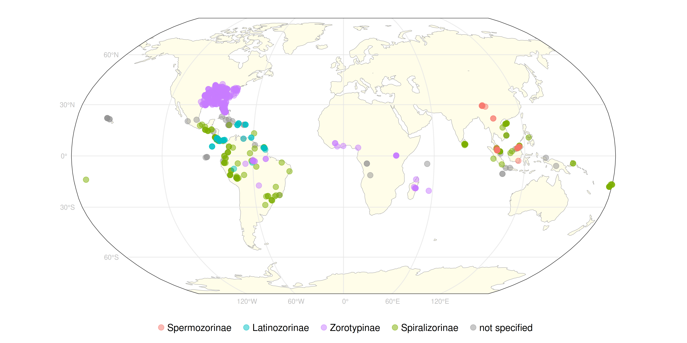
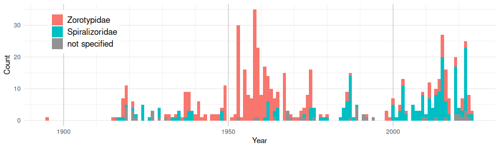

# Zoraptera Occurrence Dataset
The curated dataset of Zoraptera occurrences described in the paper "". The dataset is stored in `zoraptera.csv` file, its based on Darwin Core standard, and  is updated manually or by semi-automated workflow described below.

## How to cite:

## Custom data fields:
Besides fields defined by Darwin Core Standard (https://dwc.tdwg.org/list/), we added five custom fields:

| Field name | Description                               |  
|------------|-------------------------------------------|
|zodID       | unique id of the record in the dataset    | 
|osmID       | id of related OSM geometry                | 
|polygon_fid | id of related polygon in `geom.gpkg` file | 
|gbifID      | id of related GBIF record                 | 
|inatID      | id of related iNaturalist record          | 

## Graphical data summary:

*Geographical distribution of Zoraptera records in the dataset by subfamily*

 *Count of Zoraptera records in the dataset across years by family*

# Dataset update workflow
All updates can be tracked in history of the file, or in commits history in general. Semi-automated updates are tracked in `update.log` file including date, source, and doi if aplicable.

## Manual updates
Simply manual manipulation of `zoraptera.csv` 

## Semi-aumtomatized updates

### iNaturalist
- designated person revise identification directly on iNaturalist
- run script `scripts/inat.r` which lookup actual iNaturalist data and check if any new identification were done by designated person (now only Petr Kočárek), and if there any, its automatically written to `zoraptera_occs.csv`, and information about update (date, source) will be written in to logfile `update.log`

### GBIF
- run script `scripts/gbif.r` which downloads latest used GBIF dataset with doi red from logfile `update.log` 
- any new data found will be written to csv file, and information about update (date, source, dataset doi) will be written in to logfile `update.log`
- csv file with the new data have to be manually checked and implemented in `zoraptera_occs.csv` acording to methods published in paper.

## Geometry (coordinates) updates
If any new record without coordinates is added to the dataset, the coordinates and positional uncertainty will be obtained following this workflow:

## QGIS
- use OSM place search plugin to find the locality by name, and copy appropriate features to the layer `geom/geom.gpkg`
- edit the geometry to represent the locality as close as possible, if the desired place is not the feature but it is related to it, add a new polygon while keeping the original feature attributes. Remove sea or ocean areas with OSM features taged `natural=coastlines`
- if the locality is not present in OSM, draw polygon manually
- simplify the polygon with QGIS `Simplify` algorithm from geoprocessing toolbox (Visvalingam algorithm, tolerance 100)
- fill the `feature_origin` attribute with categories: 
  - `manual` - not related to any OSM feature, manually digitized from the description
  - `osm_related` - features related to OSM features, not intersecting them but manually digitized based on them
  - `osm_derived` - features derived from OSM features, features intersecting each other
  - `osm_exact` - features that are exact copies of OSM features
- polygon geometry can be edited in `geom/geom.gpkg` (e.g. polygon site improvement or adding new polygons)

## R
- after any `geom/geom.gpkg` edit, the coordinates and positional uncertainty should be recalculated with `scripts/geom_calc.r` to write changes to `zoraptera_occs.csv`
